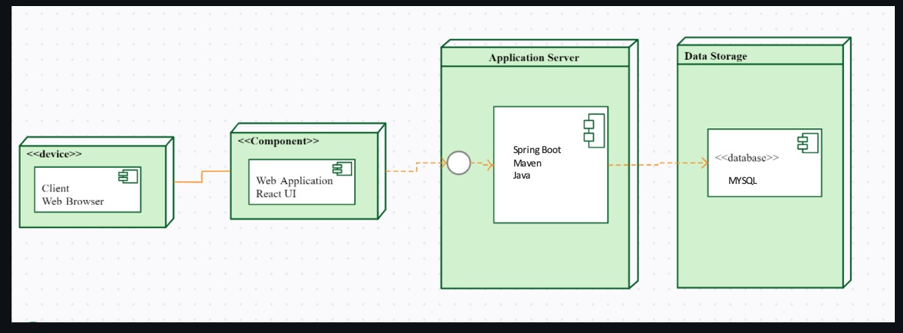

# RestaurantFinder Application
## Tech Stack
React.js, Java/Spring Boot, MySQL, AWS, OpenStreetMap API, Overpass service

## Design Choices

### Why MySQL for Database?
- **Structured Data Storage**: MySQL is a relational database, best suited for structured data - restaurants, users, reviews, and business listings.
- **ACID Compliance**: It ensures consistency in data that becomes critical in restaurant review/rating features.
- **Wide Adoption and Community Support**: A large community of developers and comprehensive documentation ensure quick fixes to challenges.
- **Integration with Spring Boot**: MySQL works perfectly well with Spring Boot, thereby allowing easy communication between the backend and database.

### Why AWS for Cloud Hosting?
- **Scalability**: AWS provides auto-scaling EC2 instances, ensuring the application can handle varying traffic loads efficiently.
- **High Availability**: AWS's load balancers ensure that the application remains accessible even if one or more servers fail.
- **Global Reach**: AWS provides infrastructure in multiple regions, ensuring faster response times for users worldwide.
- **Integrated Ecosystem**: AWS provides services such as RDS for MySQL hosting, S3 for static asset storage, and CloudWatch for monitoring, making deployment and maintenance much easier.

### Why OpenStreetMap API for Location Services?
- **Open Source**: OpenStreetMap is free to use, licensed, and has no licensing restrictions, thus making it very cost-effective to integrate location-based services.
- **Customizability**: It allows developers to customize maps and access raw geolocation data for flexibility in advanced features such as filtering by location.
- **Global Coverage**: OpenStreetMap provides comprehensive global coverage, enabling any region to be searched for restaurants.

### Why Overpass Service for Querying Map Data?
- **Efficient Geospatial Queries**: Overpass efficiently queries data from OpenStreetMap, such as restaurants within a radius or category.
- **Flexibility**: Advanced querying of geospatial data is supported, including things like finding nearby restaurants that are not listed by business owners.
- **Compatibility**: Overpass works smoothly with OpenStreetMap, which provides consistent and reliable location-based functionality.

## Architecture Diagram

## Use Case Diagram

## Database Design

## Deployment Diagram

## Feature Set

### For All Users:
- **Search Restaurants**:  
  Search for restaurants by various parameters, including:
  - Name
  - Category (e.g., type of cuisine, food preferences like Vegetarian/Vegan)
  - Price Range (Low/Medium/High)
  - Ratings (1 to 5 stars)

- **View Restaurant Details**:  
  View detailed information about restaurants, including:
  - Reviews and Ratings
  - Address and Contact Details

- **Submit Reviews and Ratings**:  
  Post reviews and rate restaurants based on user experience.

- **Location-Based Search**:  
  Search for restaurants by location using a Maps API, even if the restaurant is not listed by the business owner.

- **User Registration and Login**:  
  Create an account and log in to access user-specific features.

---

### For Business Owners:
- **Add New Listings**:  
  Add new restaurants to the platform, including:
  - Name, Address, and Contact Information
  - Hours of Operation
  - Description and Photos

- **Update Listings**:  
  Modify existing restaurant details, including:
  - Contact Info
  - Descriptions and Photos
  - Operating Hours

- **Manage Owned Listings**:  
  View and manage all restaurant listings owned by the business (e.g., restaurant chains).

- **Manual Registration**:  
  Register manually to gain access to the Business Owner role.

---

### For Admins:
- **Detect Duplicate Listings**:  
  Identify and manage duplicate restaurant entries in the system.

- **Remove Listings**:  
  Remove restaurants from the platform if the business is closed or inactive.

- **Role-Based Access**:  
  Admins have privileged access to manage all restaurant data on the platform.

---

### Deployment and Integration:
- **API Integration**:  
  - Use OpenStreetMap API and Overpass Service for geospatial queries.
  - Provide location-based restaurant search functionality.

- **Cloud Hosting**:  
  - APIs and database are deployed on an auto-scaled AWS EC2 cluster with a load balancer for high availability.

- **Responsive UI**:  
  A user-friendly web application developed with React.js, providing seamless interaction for all roles (Users, Business Owners, Admins).

## UI Wireframes

### Adding New Restaurant

### Adding Reviews

### Admin Account

### Admin Dashboard

### Registration and SignIn

### Restaurant Owner Dashboard

### Review

### Searching Restaurant

### Searching by Location

## Daily Scrum Sheet
[Click here to view the Daily Scrum Sheet](DAILYSCRUMSHEET_TeamABHR.xlsx)

## Sprint Journal
[Click here to view the Sprint Journal](Journal-ABHR.pdf)
